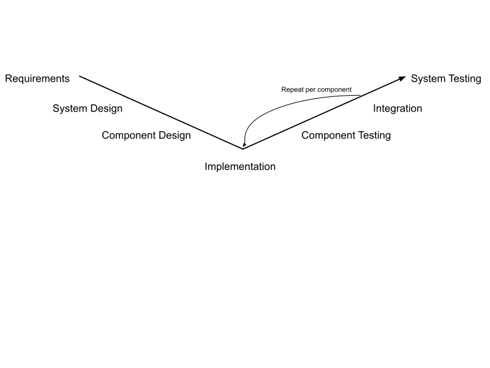
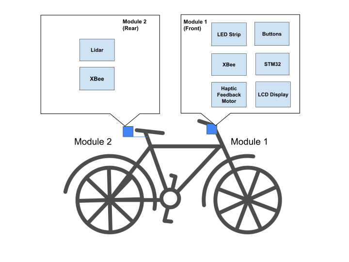
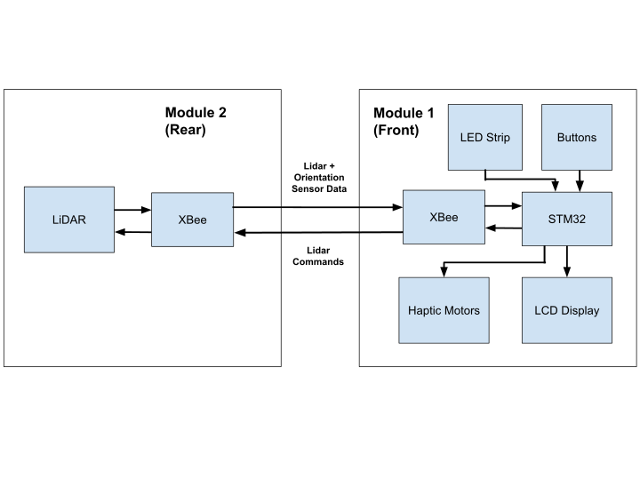
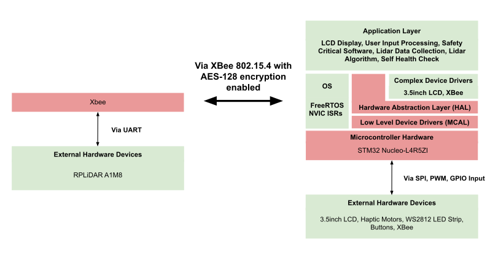

# Smart Bike Safety System - LIDAR-Based Blind Spot Detection

## Section 1: Project Overview

The project is a bike utility designed to enhance biker safety and information. The system detects vehicles approaching in the biker blind spot and notifies the user. The system also provides real-time data such as objects around the user and the user's speed on an integrated LCD display. The biker can use buttons to light right or left turn signals on the bike.

The project is developed for **STM32L4+ Series Arm-based 32-bit MCUs**. The IDE used for development is **STM32CubeIDE**. This project was developed with **C**.

### Hardware Components

- 2x STM32 Nucleo-L4R5ZI boards
- 1x RPLidar A1M8
- 2x Xbee modules (S1 series)
- 2x Haptic Motors
- 1x 3.5inch LCD (ILI9488)
- 1x WS2812 LED Strip
- 4x Buttons

### Additional Notes

This project was initally started for a group project consisting of 3 people for an Embedded Systems Course's (EECS 373 @UMich) Final project.

---

## Section 2: Development Workflow

---

## Section 3: Requirements

Priorities are in order of importance of how much they contribute to safety critical decisions.

| Priority | Requirement | 
|----------|-------------|
| **Priority 1** | Notify user when incoming vehicles are approaching in the user's blind spots
| **Priority 2** | Display most updated hazard mapping on LCD
| **Priority 3** | Display appropiate user interface for user

---

## Section 4: System Design

The design is split into two main subsystems (the front and rear parts of the bike), and they will be able to communicate wirelessly via XBee transceivers:

### Module 1 (Front of Bike)

- LCD screen in the center that displays objects detected from the lidar on module 2
- Two haptic motors on each handle bar respectively. The haptic feedback generated by the motor on each handle bar will notify the biker if there is a vehicle on their blindspot.
- Button on each handle bar that a biker can press to light a LED Strip.

### Module 2 (Rear of Bike)

- LIDAR detects objects in blind spots. It will send its data via the XBee to module 1.

### Functional Diagram

### Software Architecture

**Note:**
- Work in **green** are the layers I worked on.
- Work in **red** is configured/abstracted by me with the CubeIDE .ioc (configuration file) tool + CubeIDE's abstraction libraries.

## Section 5: Component Design

### OS / RTOS Support
- **FreeRTOS**: Five tasks (LiDAR, Haptics, LEDs, Retry, Mode change) synchronized with mutexes and semaphores.
- **SysTick**: 1 ms RTOS timebase and software timers (haptic pulse, watchdog).
- **NVIC**: Preemptive priorities set for UART DMA RX and timer callbacks.

### LiDAR Ingest & Processing
- **UART + DMA**: Command/response link to LiDAR with zero-copy buffered RX; ISR signals processing via semaphore.
- **Processing**: Polar-to-grid mapping with temporal decay, protected by a mutex.

### Display (LCD)
- **SPI**: Drives the ILI9488 LCD.
- **Rendering**: Mode-dependent views (raw, filtered, zone) updated in the display task.

### Haptics
- **GPIO outputs**: Dual motors for left/right alerts.
- **Software timers**: One-shot pulses per trigger; zone checks under mutex to decide vibration.

### LEDs (WS2812)
- **PWM/Timer + GPIO**: Drives the LED strip; LED task updates status each cycle.

### Wireless (XBee)
- **UART**: Front ↔ rear module data relay (LiDAR data upstream; display/haptics downstream).
- **Error detection & recovery**: Continuously monitors for XBee communication loss or data misalignment and automatically realigns the data stream to recover from faults.

### Buttons / Input
- **GPIO inputs**: Mode, filter, and left/right controls, polled/debounced in the mode task.

### Safety / Diagnostics
- **Watchdog (software timer)**: Triggers reconnect on LiDAR data timeout; RX activity resets the timer.
- **Error recovery**: UART overrun cleared and LiDAR reconnect attempted in the retry task.